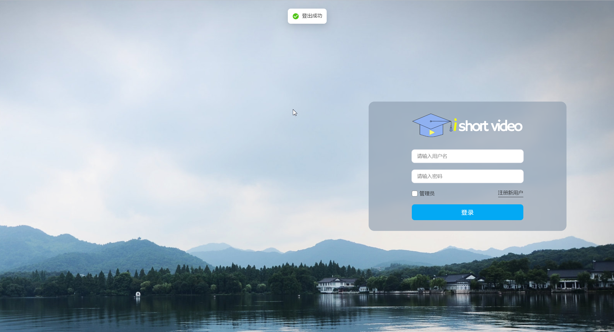
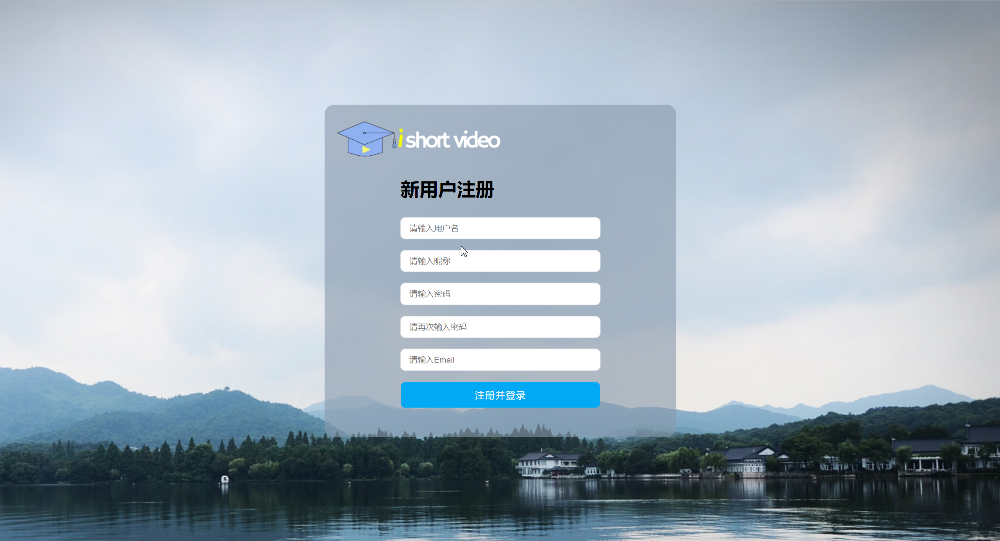
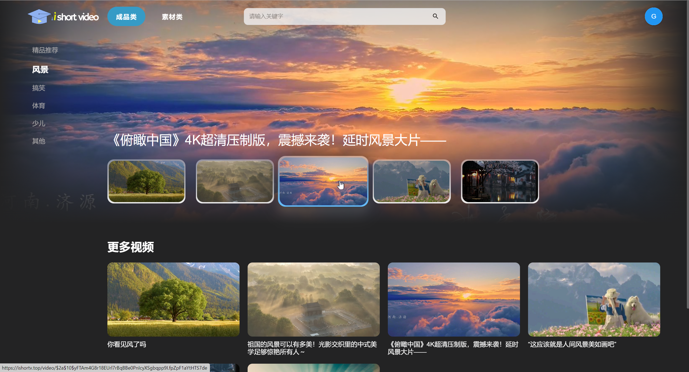
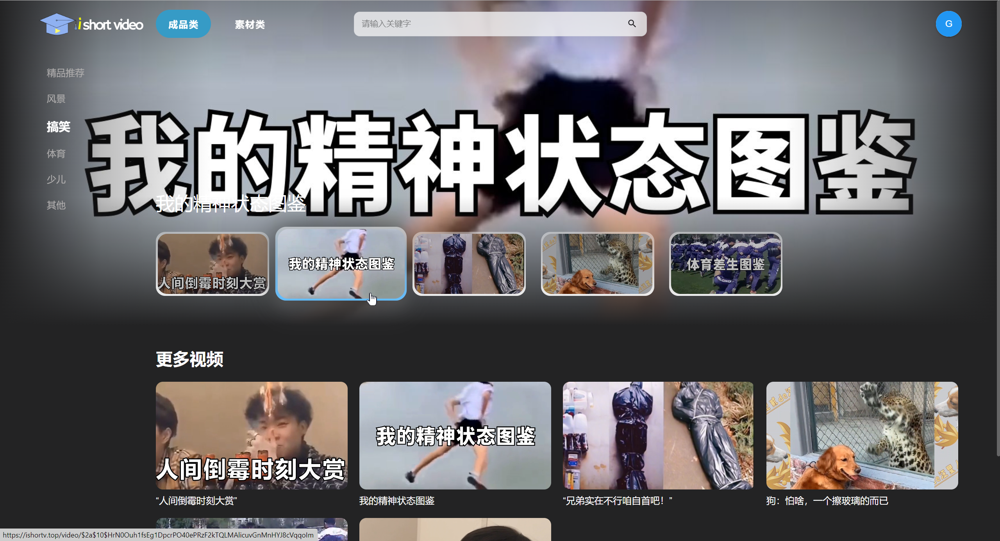
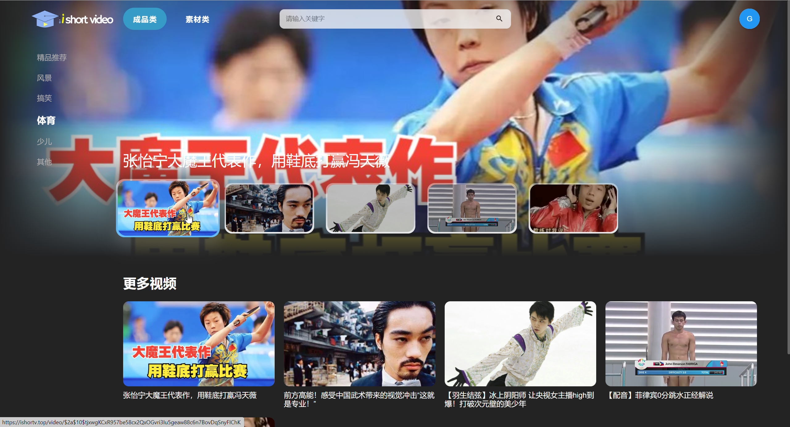
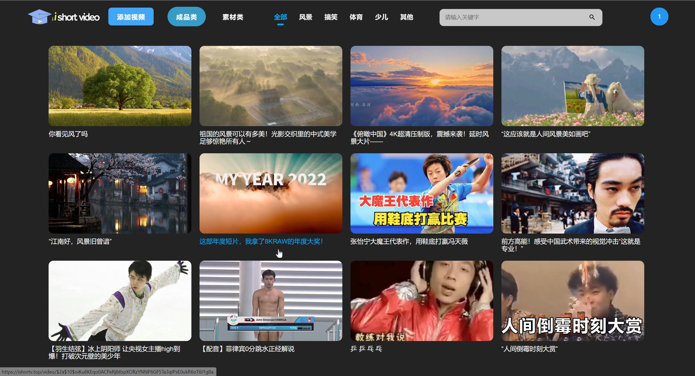
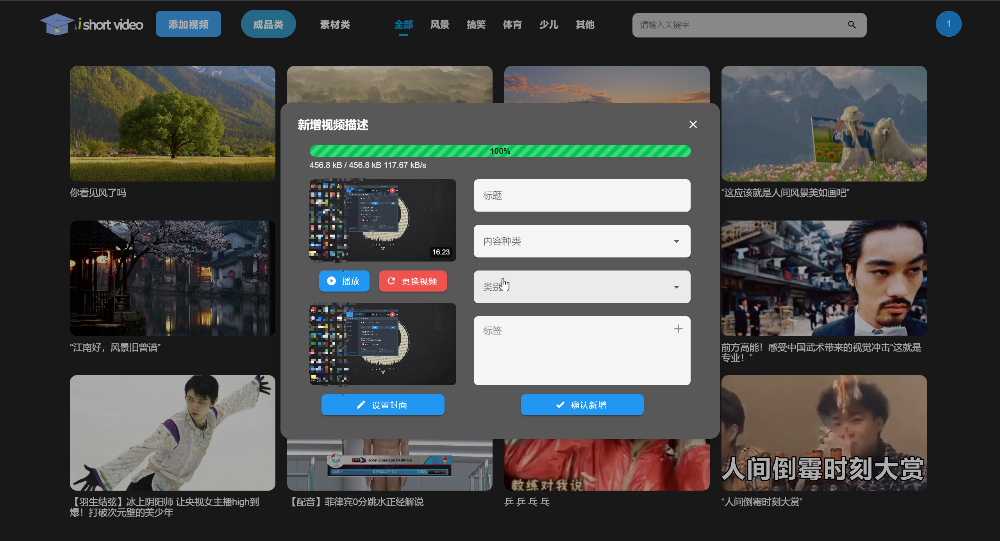
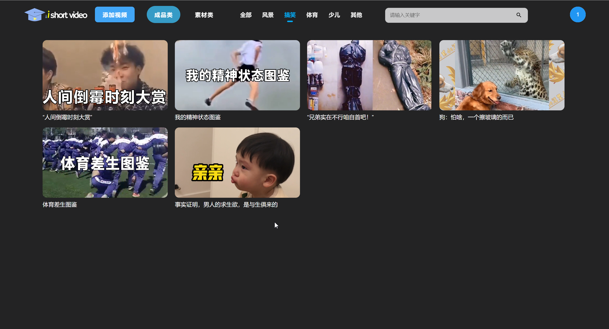

# Ishortv

## 一、项目介绍

#### 1. 项目名称
短视频平台

#### 2. 项目功能
- 用户端
  - 浏览短视频素材
  - 查看登录访问等
- 管理端
  - 管理用户，视频等素材

#### 3. 项目简介
- 前端：Next.js 框架，服务端渲染项目
- 后端：SpringBoot2.4.2 + SpringCloudAlibaba + Nacos + MybatisPlus + Actable + JWT + Mysql + Redis + 腾讯云COS + FFmpeg + Hutool工具类
- 项目管理：Maven
- 项目部署：nginx 反向代理
- 项目版本管理：Git
- 项目协作：Github

#### 4. 项目特点
注：我主要开发后端，前端学习同学请移步 https://github.com/Logosww/ishortv-site
- 前后端分离 
- 前端主要使用Next.js框架，实现服务端渲染，SEO优化 来完成 
- 后端介绍
  - SpringCloudAlibaba技术栈，融合nacos,gateway,feign,ribbon等组件来实现微服务架构
  - Springboot为基础的Maven父子工程项目
  - 使用MybatisPlus来实现数据库的CRUD操作，并整合actable来实现数据库的自动建表 
  - 使用JWT来实现用户登录验证 鉴权等操作配合网关进行拦截过滤
  - 使用Redis来实现缓存，Mysql来存储数据 
  - 使用腾讯云COS来存储图片视频等素材 并整合学习了对象存储，cdn等云服务学习，使用，自己编写对应工具类来实现文件的上传下载等操作
  - 使用FFmpeg来实现视频转码等操作，来实现在线点播效果
  - 使用Hutool工具类来实现各种工具类的使用，如：加密，文件操作，日期操作，http请求等

## 二、项目演示
项目地址：https://ishortv.top
普通账号密码   guest 
管理员账号密码 123456

- 登录 
- 注册 
- 首页 
- 分类 
- 预览 
- 管理页面 
- 新增 
- 管理分类 

## 三、项目启动
- 配置MySQL，redis，ffmpeg，nacos，cos等环境
- 启动jar包即可

## 四、项目收获
- 学习了微服务的基本原理和使用，并整合springalibabacloud的相关组件
- 掌握了ffmpeg的主要用法和编写自己的工具类
- 学习使用了hutool工具类，掌握了各种工具类的使用，方便开发
- 学习了腾讯云的对象存储，cdn等云服务，掌握了使用，编写自己的工具类
- 深入了解了git, maven的一些版本差异问题和配置细节，如父子maven的依赖，版本冲突等
- 学习了jwt和网关层访问拦截的知识，并尝试cookie模式的单点登录
- 学习了mysql的自动建表，mybatisplus的使用，以及actable的使用
- 掌握了redis，mysql的数据库知识，又巩固了对应缺失的知识点

最后，项目持续更新中哦，欢迎star，fork，issue，pr，感谢大家的支持，有问题可以联系我哦，一起学习，一起进步，一起加油！
